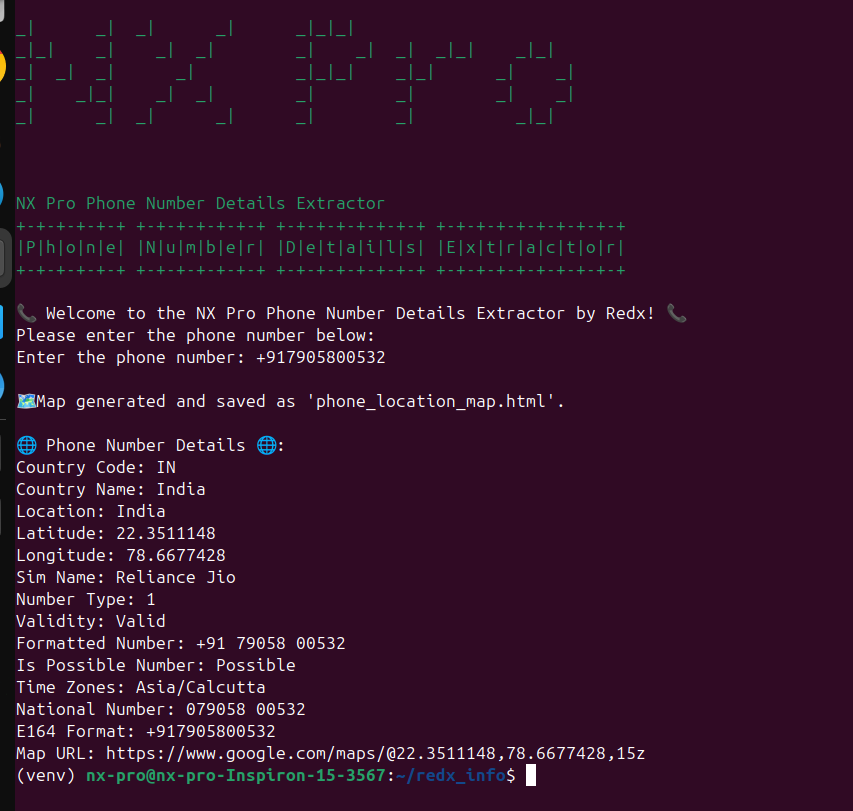

# NX Pro - Phone Number Details Extractor



NX Pro is a powerful Python-based phone number details extractor. With this tool, you can quickly gather essential details about any phone number, such as its carrier, location, time zone, and much more. Additionally, the tool can generate a map showing the geographic location of the phone number if available.

## Features

- **Carrier Identification**: Find out the carrier or service provider of the phone number.
- **Location Information**: Retrieve the geographic location associated with the phone number.
- **Time Zone Information**: Get the time zones related to the phone number's location.
- **Phone Number Validity**: Check if the phone number is valid and possible.
- **Interactive Map**: Generate and save an interactive map showing the phone number's location using Folium.
- **Formatted Number**: View the phone number in various international formats.

## Installation

Before running the script, ensure you have the following Python packages installed:

```bash
pip install phonenumbers geopy folium pyfiglet colorama requests
```

## Usage

To use the NX Pro Phone Number Details Extractor, simply run the script and input the desired phone number when prompted.

```bash
python phone_number_extractor.py
```

### Example Output

```
NX Pro
NX Pro Phone Number Details Extractor
Phone Number Details Extractor

📞 Welcome to the NX Pro Phone Number Details Extractor by Redx! 📞
Please enter the phone number below:
Enter the phone number: +1234567890

🌐 Phone Number Details 🌐:
Country Code: US
Country Name: United States
Location: California
Latitude: 36.778259
Longitude: -119.417931
Sim Name: Verizon Wireless
Number Type: Mobile
Validity: Valid
Formatted Number: +1 234-567-890
Is Possible Number: Possible
Time Zones: America/Los_Angeles
National Number: (234) 567-890
E164 Format: +1234567890
Map URL: https://www.google.com/maps/@36.778259,-119.417931,15z

🗺️ Map generated and saved as 'phone_location_map.html'.
```

## Map Generation

If the geographic location is successfully determined, the tool generates an interactive map and saves it as `phone_location_map.html`. You can open this file in any web browser to view the location on the map.

## Error Handling

The script includes error handling for common issues, such as parsing errors and invalid phone numbers. In case of any errors, appropriate error messages will be displayed.

## Contributing

Contributions are welcome! If you find a bug or have a feature request, feel free to open an issue or submit a pull request.

## License

This project is licensed under the MIT License - see the [LICENSE](LICENSE) file for details.

## Credits

NX Pro was developer.
